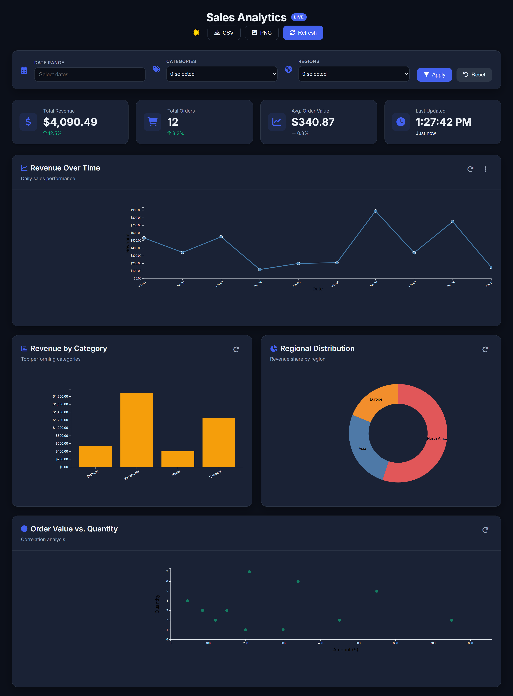
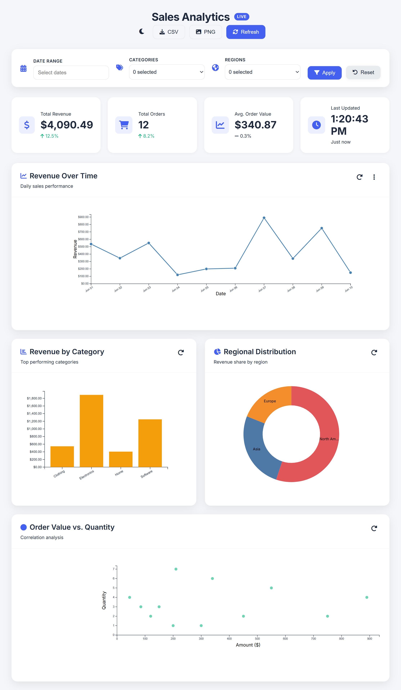

# Sales Insight Dashboard

A professional-grade Data Visualization Dashboard designed to provide actionable business insights through interactive charts and real-time data filtering.

## Key Features
- **Dynamic Charts:** Built using **D3.js** for smooth data representation.
- **Advanced Filtering:** Multi-select filtering for Categories and Regions, combined with date range selection.
- **Responsive Layout:** Optimized for Desktop, Tablet, and Mobile devices.
- **KPI Metrics:** Instant calculation of Revenue, Total Orders, and Average Order Value.
- **Theme Support:** Switchable Light and Dark modes.

## 🛠 Tech Stack
- **Backend:** Python (Flask), SQLite
- **Frontend:** HTML5, CSS3, Vanilla JavaScript, D3.js
- **Icons/UI:** Modern minimalist design

## How to Run
1. Clone the repo: `git clone https://github.com/Khair-Ullah/Data-Viusalization-Dashboard.git`
2. Install requirements: `pip install -r requirements.txt`
3. Initialize the DB: `python database/init_db.py`
4. Run the App: `python app.py`

### Dashboard Preview

### Last update : june 2026